# APT Sapienza — Student's task

**Advanced Programming Techniques** — Sapienza University of Rome

A hands-on lab for building and deploying a **cloud-native batch processing pipeline** on AWS. Students provision infrastructure with **Terraform**, containerize a Python application with **Docker**, and execute it as a serverless job on **AWS Batch (Fargate)**.

---

## Table of Contents

- [Purpose of the Lab](#purpose-of-the-lab)
- [What You Will Learn](#what-you-will-learn)
- [Architecture](#architecture)
  - [High-Level Overview](#high-level-overview)
  - [Infrastructure Components](#infrastructure-components)
  - [Data Flow](#data-flow)
- [Project Structure](#project-structure)
- [Technology Stack](#technology-stack)
- [Prerequisites](#prerequisites)
- [Getting Started](#getting-started)
  - [1. Configure Variables](#1-configure-variables)
  - [2. Provision Infrastructure](#2-provision-infrastructure)
  - [3. Upload Input Data](#3-upload-input-data)
  - [4. Build & Push the Docker Image](#4-build--push-the-docker-image)
  - [5. Submit a Batch Job](#5-submit-a-batch-job)
  - [6. Verify the Output](#6-verify-the-output)
- [Local Development](#local-development)
- [Cleanup](#cleanup)
- [License](#license)

---

## Purpose of the Lab

This project is a **didactic lab** for the *Advanced Programming Techniques* course at Sapienza. Its goal is to teach students how to:

1. **Define cloud infrastructure as code** — write declarative Terraform configurations to provision a full AWS environment (networking, storage, compute, IAM).
2. **Containerize an application** — package a Python program into a Docker image, push it to a private container registry (ECR), and run it in a serverless compute environment.
3. **Design a batch processing pipeline** — use Amazon S3 as a data lake with separate input/output prefixes, and AWS Batch with Fargate to execute the processing job without managing servers.
4. **Understand IAM and security** — configure task execution roles, and least-privilege policies (with educational shortcuts noted in the code).

The business logic is intentionally simple (summing numbers from a file) so that students can focus on the **cloud engineering and DevOps aspects** rather than the application logic itself.

---

## What You Will Learn

| Area | Concepts |
|---|---|
| **Infrastructure as Code** | Terraform providers, resources, variables, outputs, `tfvars` |
| **Networking** | VPC, subnets, internet gateways, route tables, security groups |
| **Storage** | S3 buckets, object prefixes, data upload/download via `boto3` |
| **Containers** | Dockerfiles, image tagging, ECR authentication, multi-architecture builds |
| **Serverless Compute** | AWS Batch, Fargate, compute environments, job queues, job definitions |
| **IAM** | Assume-role policies, managed policy attachments, task execution roles |
| **Python** | `boto3` SDK, OOP design, logging, environment variable configuration |

---

## Architecture

### High-Level Overview

```mermaid
flowchart TB
    subgraph Developer["👨‍💻 Developer Machine"]
        TF["Terraform CLI"]
        Docker["Docker CLI"]
        Script["Bash Scripts"]
    end

    subgraph AWS["☁️ AWS Cloud — eu-west-1"]
        subgraph VPC["VPC 10.0.0.0/16"]
            subgraph Subnet["Public Subnet 10.0.1.0/24"]
                Fargate["AWS Fargate Task<br/>(Python Container)"]
            end
            IGW["Internet Gateway"]
            SG["Security Group<br/>(outbound-only)"]
        end

        ECR["ECR Repository"]
        S3["S3 Bucket"]
        Batch["AWS Batch"]
        IAM["IAM Roles"]

        subgraph S3_Detail["S3 Bucket Structure"]
            Input["📂 input/addends.txt"]
            Output["📂 output/sum.txt"]
        end
    end

    TF -- "provisions" --> VPC
    TF -- "provisions" --> ECR
    TF -- "provisions" --> S3
    TF -- "provisions" --> Batch
    TF -- "provisions" --> IAM

    Docker -- "push image" --> ECR
    ECR -- "pull image" --> Fargate
    Batch -- "launches" --> Fargate
    Fargate -- "reads" --> Input
    Fargate -- "writes" --> Output
    Fargate --> IGW
    IGW --> Fargate
```



### Infrastructure Components

The Terraform configuration (`main.tf`) provisions five logical layers:

#### 1. Network Stack
| Resource | Purpose |
|---|---|
| `aws_vpc` | Isolated virtual network (`10.0.0.0/16`) |
| `aws_subnet` (public) | Hosts Fargate tasks with public IP (`10.0.1.0/24`, `eu-west-1a`) |
| `aws_internet_gateway` | Enables outbound internet access for image pulling & S3 communication |
| `aws_route_table` + association | Routes `0.0.0.0/0` traffic through the IGW |
| `aws_security_group` | Allows all outbound traffic, no inbound rules |

#### 2. Storage & Registry
| Resource | Purpose |
|---|---|
| `aws_s3_bucket` | Data lake for input/output files (prefix-separated) |
| `aws_ecr_repository` | Private Docker image registry |

> Both resources have `force_destroy` / `force_delete` enabled for easy lab cleanup — **not recommended for production**.

#### 3. IAM Roles
| Role | Trusted Service | Purpose |
|---|---|---|
| ECS Task Execution Role | `ecs-tasks.amazonaws.com` | Allows Fargate to pull images from ECR, write logs, and access S3 |

> `AmazonS3FullAccess` is attached for educational simplicity — in production, scope this down to the specific bucket ARN.

#### 4. Compute Environment & Queue
| Resource | Purpose |
|---|---|
| `aws_batch_compute_environment` | Managed Fargate compute pool (max 16 vCPUs) |
| `aws_batch_job_queue` | Job submission queue linked to the compute environment |

#### 5. Job Definition
| Property | Value |
|---|---|
| Platform | Fargate |
| vCPU | 0.25 |
| Memory | 512 MB |
| Architecture | Configurable (`ARM64` / `X86_64`) |
| Environment Variables | `BUCKET_NAME`, `INPUT_PREFIX`, `OUTPUT_PREFIX` |

### Data Flow

```mermaid
sequenceDiagram
    participant User as 👨‍💻 User
    participant S3 as S3 Bucket
    participant Batch as AWS Batch
    participant Fargate as Fargate Task
    
    User->>S3: 1. Upload addends.txt to input/
    User->>Batch: 2. Submit job
    Batch->>Fargate: 3. Launch container from ECR image
    Fargate->>S3: 4. Download input/addends.txt
    Note over Fargate: 5. Parse numbers & compute sum
    Fargate->>S3: 6. Upload output/sum.txt
    User->>S3: 7. Download output/sum.txt
```



---

## Project Structure

```
aptsapienza/
├── main.py                          # Python application (S3BucketManager + Adder)
├── main.tf                          # Terraform infrastructure definition
├── terraform_tfvars_template.txt    # Template for terraform.tfvars
├── Dockerfile                       # Containerization (python:3.14-slim)
├── build_and_push_to_ecr.sh         # Script to build & push Docker image to ECR
├── local_launch_with_aws_profile.sh # Script to run main.py locally
├── requirements.txt                 # Python dependencies (boto3)
├── input/
│   └── addends.txt                  # Sample input file (numbers) to be uploaded to S3
├── .gitignore                       # Ignores Terraform state, venvs, Docker, OS files
└── LICENSE                          # GNU GPLv3
```

### Key Files

| File | Description |
|---|---|
| **`main.py`** | Contains `S3BucketManager` (S3 I/O operations) and `Adder` (number summing logic). Reads configuration from environment variables. |
| **`main.tf`** | Single-file Terraform configuration that provisions the entire AWS stack: VPC, S3, ECR, IAM, Batch compute environment, job queue, and job definition. |
| **`Dockerfile`** | Builds a slim Python 3.14 image with a virtual environment, installs `boto3`, and sets `main.py` as the entrypoint. |
| **`build_and_push_to_ecr.sh`** | Automates ECR login, Docker build, tag, and push. Reads the ECR URL from Terraform output. |
| **`local_launch_with_aws_profile.sh`** | Runs `main.py` locally with a named AWS profile. Creates a venv, installs dependencies, sets env vars from Terraform output. |
| **`terraform_tfvars_template.txt`** | Template to create `terraform.tfvars` — includes `project_name`, `docker_image_tag`, and `docker_image_architecture`. |

---

## Technology Stack

| Layer | Technology | Version / Details |
|---|---|---|
| **Language** | Python | 3.14 |
| **AWS SDK** | boto3 | Latest |
| **IaC** | Terraform | AWS Provider `~> 6.0` |
| **Container** | Docker | `python:3.14-slim` base image |
| **Compute** | AWS Batch + Fargate | Serverless containers |
| **Storage** | Amazon S3 | Prefix-based partitioning |
| **Registry** | Amazon ECR | Private container images |
| **Region** | `eu-west-1` | Ireland |

---

## Prerequisites

- **AWS Account** with an IAM user/profile named `aptsapienza` (or update `main.tf`)
- **Terraform-local** installed
- **Docker** installed and running
- **AWS-local CLI** configured with the `aptsapienza` profile
- **Python 3.14+** (for local development only)

---

## Getting Started

### 1. Configure Variables

Copy the template and edit it with your values:

```bash
cp terraform_tfvars_template.txt terraform.tfvars
```

Edit `terraform.tfvars`:

```hcl
project_name             = "apt-sapienza-fg-cloud-infra"   # Use your initials
docker_image_tag         = "v1.0"
docker_image_architecture = "ARM64"   # ARM64 for Apple Silicon, X86_64 for Intel/AMD
```

### 2. Provision Infrastructure

```bash
tflocal init
tflocal plan                  # Review the changes
tflocal apply --auto-approve  # Provision resources (type "yes" to confirm)
```

Terraform will output:
- `ecr_repository_url` — the ECR image URL
- `s3_bucket_name` — the S3 bucket name
- `job_queue_name` — the Batch job queue name

### 3. Upload Input Data

Upload the sample input file to S3:

```bash
awslocal s3 cp input/addends.txt s3://$(tflocal output -raw s3_bucket_name)/input/addends.txt \
    --profile aptsapienza
```

### 4. Build & Push the Docker Image

```bash
chmod +x build_and_push_to_ecr.sh
./build_and_push_to_ecr.sh
```

This script:
1. Retrieves the ECR repository URL from Terraform output
2. Authenticates Docker with ECR
3. Builds the image
4. Tags it as `v1.0`
5. Pushes it to ECR

### 5. Submit a Batch Job

```bash
awslocal batch submit-job \
    --job-name "my-first-job" \
    --job-queue "$(tflocal output -raw job_queue_name)" \
    --job-definition "$(tflocal output -raw job_queue_name | sed 's/-queue/-job/')" \
    --profile aptsapienza \
    --region eu-west-1
```

Monitor the job in the [AWS Batch Console](https://eu-west-1.console.aws.amazon.com/batch/home?region=eu-west-1#jobs).

### 6. Verify the Output

Once the job status is `SUCCEEDED`, download the result:

```bash
awslocal s3 cp s3://$(tflocal output -raw s3_bucket_name)/output/sum.txt ./sum.txt \
    --profile aptsapienza
cat sum.txt
```

---

## Local Development

Run the application locally (without AWS Batch) using the provided script:

```bash
chmod +x local_launch_with_aws_profile.sh
./local_launch_with_aws_profile.sh aptsapienza
```

This will:
1. Retrieve the S3 bucket name from Terraform output
2. Create a Python virtual environment (if needed) and install dependencies
3. Set the required environment variables
4. Execute `main.py`

> **Note:** You must have the input file already uploaded to S3 (`input/addends.txt`).

---

## Cleanup

Destroy all AWS resources when done to avoid charges:

```bash
tflocal destroy    # Type "yes" to confirm
```

> `force_destroy` on S3 and `force_delete` on ECR ensure a clean teardown even with existing objects/images.

---

## License

This project is licensed under the **GNU General Public License v3.0** — see the [LICENSE](LICENSE) file for details.
